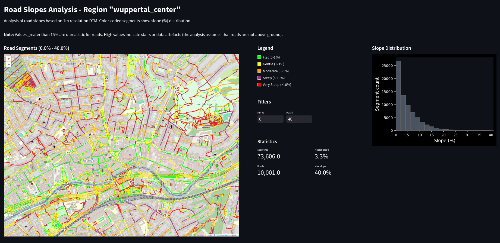

# Road Slope Analysis Dashboard
A comprehensive end-to-end project that analyzes and visualizes road slopes using a 1m resolution Digital Terrain Model (DTM). Built with PostGIS, Python, and Streamlit.



## Overview
This project creates an interactive dashboard to analyze and visualize road slopes in areas where a high-resolution Digital Terrain Model (DTM) is available. It combines spatial data processing with web visualization to help understand the distribution of road slopes. Urban planning and mobility studies can benefit from this analysis.

## Features
- 🗺️ Interactive map visualization with color-coded slope categories
- 📊 Real-time slope distribution histogram
- 📈 Statistical analysis of road segments
- 🎯 Customizable analysis areas through bounding box selection
- 🚀 Optimized performance through spatial clustering
- 🔄 Dynamic filtering of slope ranges

## Technical Stack
- **Database**: PostgreSQL + PostGIS extension
- **Backend**: Python, SQL
- **Frontend**: Streamlit, Folium
- **Data Processing**: GeoPandas, GDAL
- **Visualization**: Matplotlib, Folium

## Prerequisites

You have two options to run this project:

### Option 1: Docker (Recommended)
- [Docker](https://docs.docker.com/get-docker/)
- [Docker Compose](https://docs.docker.com/compose/install/)

This is the simplest way to get started as it handles all dependencies automatically.

### Option 2: Native Installation
1. **System Requirements**
   - PostgreSQL 12+ with PostGIS extension
   - Python 3.8+
   - GDAL utilities (gdal-bin)
   - Git
   - libpq-dev (for psycopg2)
   - osmium-tool (for OSM data conversion)

2. **System Installation (Ubuntu/Debian)**
   ```bash
   # Install system dependencies
   sudo apt update
   sudo apt install -y \
       postgresql-12 \
       postgresql-12-postgis-3 \
       postgis \
       python3-pip \
       python3-dev \
       gdal-bin \
       libgdal-dev \
       git \
       libpq-dev \
       osmium-tool

   # Start PostgreSQL service
   sudo systemctl start postgresql
   ```

   For other operating systems, please refer to their respective package managers and installation guides.

3. **Python Dependencies**
   ```bash
   # Install Python packages
   pip install -r web-app/requirements.txt
   pip install -r scripts/requirements.txt
   ```

   This will install:
   - Core dependencies: pandas, numpy, geopandas, shapely
   - Web interface: streamlit, folium
   - Database connectivity: psycopg2-binary, SQLAlchemy
   - Geospatial processing: pyproj, matplotlib, contextily
   
4. **Environment Variables**
   Make sure PostgreSQL is running and accessible. You may need to:
   - Set up a PostgreSQL user with appropriate permissions
   - Configure database access in config.py
   - Ensure PostgreSQL is listening on localhost

## Project Structure
```
.
├── config.py                 # Configuration parameters
├── database/
│   └── queries/             # SQL queries for slope analysis
├── scripts/
│   ├── bbox_selector.py     # Area selection tool
│   └── execute_queries.py   # Query execution script
├── web-app/
│   └── streamlit_app.py     # Dashboard application
├── init_db.sh               # Database initialization script
└── load_data.sh            # Data loading to database script
```

## Setup and Installation

You can run this project either using Docker (recommended) or with native installation.

### Docker Installation (Recommended)
1. Install [Docker](https://docs.docker.com/get-docker/) and [Docker Compose](https://docs.docker.com/compose/install/)

2. Clone the repository:
   ```bash
   git clone https://github.com/yourusername/road-slope-analysis.git
   cd road-slope-analysis
   ```

3. Create a `.env` file with your database settings:
   ```bash
   DB_NAME=road_slopes
   DB_USER=postgres
   DB_PASSWORD=postgres
   DB_HOST=db
   ```

4. Start the services:
   ```bash
   # If you have a local PostgreSQL running, stop it first:
   sudo systemctl stop postgresql
   
   # Start the Docker containers
   docker compose up -d
   ```

5. Initialize the database (jump this step if you are uploading data to an already initialized database):
   ```bash
   docker compose exec web ./init_db.sh
   ```

6. Load your data (tiles or single file):
   ```bash
   docker compose exec web ./load_data.sh -d path/to/dem.tif -r path/to/roads.gpkg
   ```
   Available options for load_data.sh:
   - `-d, --dtm FILE`         Path to DTM file
   - `-r, --roads FILE`       Path to roads GeoPackage
   - `-t, --tile-size SIZE`   Tile size for raster import
   - `-s, --srid EPSG`       SRID/EPSG code
   - `-p, --tiles-path PATH` Path to DTM tiles
   - `-do, --dtm-only`       Load only DTM data
   - `-ro, --roads-only`     Load only roads data

7. Select your area of interest (jump this step if your area of interest is already set in `config.py`):
   ```bash
   # Run the area selector tool
   docker compose exec web streamlit run scripts/bbox_selector.py
   ```
   - Draw your area on the map
   - Copy the generated parameters to `config.py`
   - Update the "region" field in `config.py` with your area of interest

8. With REGION=your_area_of_interest set in `config.py`, process the road slopes:
   ```bash
   # Run the analysis queries
   docker compose exec web python3 scripts/execute_queries.py
   ```

9. The application will be available at:
   - Dashboard: http://localhost:8501
   - Area Selector: Use the dashboard's interface or run the area selector again if needed

### Native Installation (Alternative)
1. Edit `config.py` to set your database parameters:
   ```python
   CONFIG = {
       "database": "your_db_name",
       "db_connection": {
           "user": "your_user",
           "password": "your_password",
           "host": "localhost"
       }
   }
   ```

2. Initialize the database:
   ```bash
   chmod +x init_db.sh
   ./init_db.sh
   ```

3. Ensure your data meets these requirements:

1. **Coordinate Reference System (CRS)**
   - High resolution DTM (5m or finer resolution) required for road segmentation - 1m resolution recommended for best results
   - Input data can be in any valid coordinate system
   - The script will automatically convert both DTM and roads data to the CRS specified in `config.py`
   - The target CRS must be a metric coordinate system (e.g., UTM)
   - No manual conversion needed - the script handles this automatically
   - Example of setting target CRS in `config.py`:
     ```python
     CONFIG = {
         "dtm_crs": "EPSG:25832",  # UTM Zone 32N
         # ... other config options ...
     }
     ```

2. **Data Formats**
   - DTM: GeoTIFF format (.tif)
   - Roads: GeoPackage format (.gpkg) from OpenStreetMap
   - Roads GeoPackage should contain only one layer

4. Load your data using the provided script:
```bash
chmod +x load_data.sh
./load_data.sh [options]
```

Available options:
- `-d, --dtm FILE`         Path to DTM file
- `-r, --roads FILE`       Path to roads GeoPackage
- `-t, --tile-size SIZE`   Tile size for raster import
- `-s, --srid EPSG`       SRID/EPSG code
- `-p, --tiles-path PATH` Path to DTM tiles
- `-do, --dtm-only`       Load only DTM data
- `-ro, --roads-only`     Load only roads data

## Data Preparation

### Quick Start with Pre-converted Data
The repository includes ready-to-use GeoPackage files in the `data` directory:
- `roads_koeln_25832.gpkg` (EPSG:25832 - UTM Zone 32N)
- `roads_duesseldorf_25832.gpkg` (EPSG:25832 - UTM Zone 32N)

These files are immediately usable with the analysis pipeline. They are already projected in EPSG:25832 (UTM Zone 32N), which is the metric coordinate system for North Rhine-Westphalia, Germany. For most users, starting with these examples is recommended.

### Converting Data for New Cities

#### Option 1: Using Pre-converted Files
The easiest approach is to use pre-converted GeoPackage files:
1. Download pre-converted `.gpkg` files from OpenStreetMap platforms like [OSM2World](https://osm2world.org/) or [Geofabrik's Downloads](https://download.geofabrik.de/) (when available)
2. Place the files in your data directory
3. Proceed with the analysis

#### Option 2: Manual Conversion (Advanced)
If you need to convert OSM data yourself:

**Linux/Ubuntu:**
```bash
# Install tools
sudo apt-get install osmium-tool

# Convert data (with correct CRS)
osmium cat input.osm.pbf -o output.osm
ogr2ogr -f GPKG -t_srs EPSG:25832 output_25832.gpkg output.osm -nln roads -oo CONFIG_FILE=data/osmconf.ini lines

# Note: This command will:
# - Convert to EPSG:25832 (UTM Zone 32N)
# - Create a clean roads layer named 'roads'
# - Apply road type filtering based on osmconf.ini configuration
```

The filtering of road types and attributes is handled by the `data/osmconf.ini` configuration file, which:
- Selects relevant road attributes (name, surface, lanes, etc.)
- Filters for specific road types (motorway, primary, secondary, etc.)
- Excludes non-road features and NULL values

**Windows:**
- Use [OSGeo4W](https://trac.osgeo.org/osgeo4w/) installer which includes GDAL/OGR tools
- Or use [QGIS](https://qgis.org/) (includes necessary conversion tools)
- Use the same ogr2ogr command as above

**macOS:**
```bash
# Install tools using Homebrew
brew install osmium-tool gdal

# Convert data (same command as Linux)
osmium cat input.osm.pbf -o output.osm
ogr2ogr -f GPKG -t_srs EPSG:25832 output_25832.gpkg output.osm -nln roads -oo CONFIG_FILE=data/osmconf.ini lines
```

> **Note**: The core analysis pipeline runs in Docker and works identically across all platforms. Data conversion is a one-time setup step that can be done using various tools depending on your operating system.

## Running the Analysis

## Usage

### With Docker
1. Select Analysis Area:
   ```bash
   docker-compose exec web streamlit run scripts/bbox_selector.py
   ```

2. Process Data:
   ```bash
   docker-compose exec web python3 scripts/execute_queries.py
   ```

3. Launch Dashboard:
   The dashboard should already be running at http://localhost:8501

### Without Docker
1. Select Analysis Area
1. Run the bounding box selector:
   ```bash
   streamlit run scripts/bbox_selector.py
   ```
2. Draw your area of interest on the map
3. Copy the generated coordinates to `config.py`

4. Process Data
Run the slope analysis:
```bash
python3 scripts/execute_queries.py
```

5. Launch Dashboard
Start the interactive dashboard:
```bash
streamlit run web-app/streamlit_app.py
```

## Technical Details

### Slope Calculation Process
1. Roads are segmented based on length:
   - < 50m: 5m segments
   - < 100m: 10m segments
   - ≥ 100m: 25m segments

2. For each segment:
   - Elevation is extracted from DTM
   - Slope is calculated as rise/run * 100
   - Results are categorized into:
     - Flat (0-1%)
     - Gentle (1-3%)
     - Moderate (3-6%)
     - Steep (6-10%)
     - Very Steep (>10%)
3. Roads labeled as bridges are automatically excluded from the analysis to avoid incorrect slope calculations

### Performance Optimizations
- Spatial indexing on geometries
- Geometry clustering for visualization
- Efficient SQL queries with PostGIS functions
- Area size limits to prevent memory issues

## Current Limitations and Future Improvements

### Current Limitations
- The analysis assumes all roads are at ground level by using a DTM, which may not always be true (e.g., elevated roads, underpasses)
- Very steep slopes (>15%) often indicate stairs, data artifacts or non-ground structures

### Potential Improvements
- Implement methods to identify and handle non-ground structures or tunnels (e.g. using 3D road data or DSM)
- Include additional road attributes in the analysis

## Contributing
Contributions are welcome! Please feel free to submit a Pull Request.

## License
This project is licensed under the MIT License - see the [LICENSE](LICENSE) file for details.

## Acknowledgments
- Digital Elevation Model data: [Geoportal NRW](https://www.geoportal.nrw)
- Road network data: OpenStreetMap contributors


