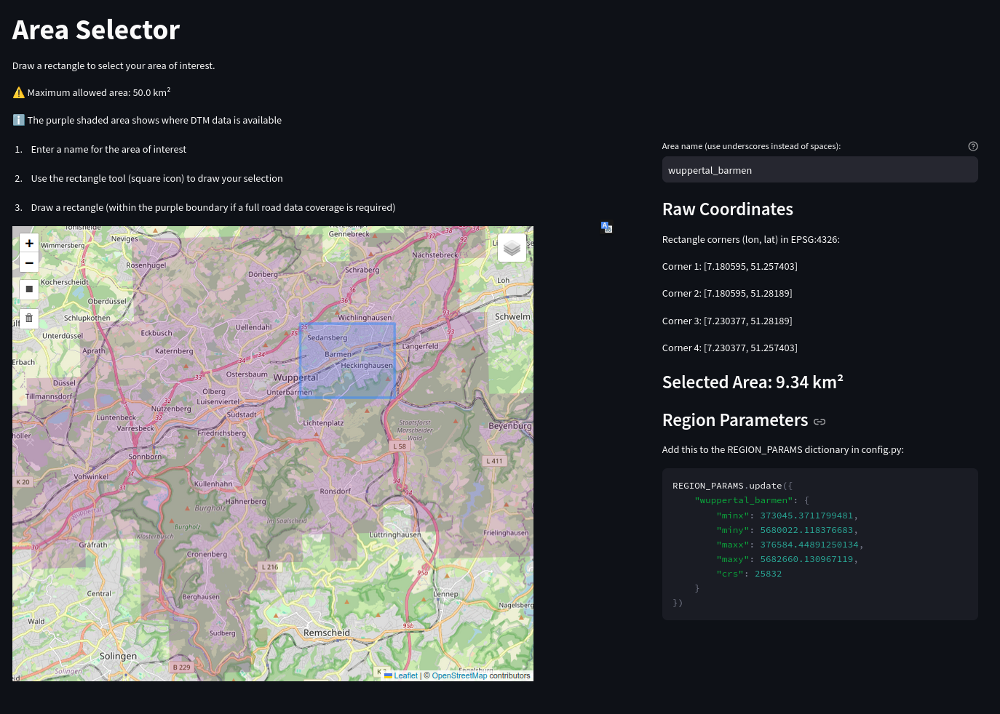

# Road Slope Analysis Dashboard
A comprehensive end-to-end project that analyzes and visualizes road slopes using a 1m resolution Digital Terrain Model (DTM). Built with PostGIS, Python, and Streamlit.




## Overview
This project creates an interactive dashboard to analyze and visualize road slopes in areas where a high-resolution Digital Terrain Model (DTM) is available. It combines spatial data processing with web visualization to help understand the distribution of road slopes. Urban planning and mobility studies can benefit from this analysis.

## Features
- 🗺️ Interactive map visualization with color-coded slope categories
- 📊 Real-time slope distribution histogram
- 📈 Statistical analysis of road segments
- 🎯 Customizable analysis areas through bounding box selection
- 🚀 Optimized performance through spatial clustering
- 🔄 Dynamic filtering of slope ranges

## Technical Stack
- **Database**: PostgreSQL + PostGIS extension
- **Backend**: Python, SQL
- **Frontend**: Streamlit, Folium
- **Data Processing**: GeoPandas, GDAL
- **Visualization**: Matplotlib, Folium

## Getting Started

### Option 1: Docker (Recommended)

**Prerequisites:**
- [Docker](https://docs.docker.com/get-docker/) and [Docker Compose](https://docs.docker.com/compose/install/)

**Setup & Usage:**
1. Clone the repository:
   ```bash
   git clone https://github.com/gmenesesprovoste/road-slope-analysis.git
   cd road-slope-analysis
   ```

2. Create a `.env` file with your database settings:
   ```bash
   DB_NAME=road_slopes
   DB_USER=postgres
   DB_PASSWORD=postgres
   DB_HOST=db
   ```

3. Start the services:
   ```bash
   # If you have a local PostgreSQL running, stop it first:
   sudo systemctl stop postgresql
   
   # Start the Docker containers
   docker compose up -d
   ```

4. Initialize the database:
   ```bash
   docker compose exec web ./init_db.sh
   ```

5. Load your data:
   ```bash
   docker compose exec web ./load_data.sh -d path/to/dem.tif -r path/to/roads.gpkg
   ```

6. Select your area of interest:
   ```bash
   docker compose exec web streamlit run scripts/bbox_selector.py
   ```
   - Draw your area on the map
   - Copy the generated parameters to `config.py`

7. Process the road slopes after setting the region variable to your area of interest in `config.py`:
   ```bash
   docker compose exec web python3 scripts/execute_queries.py
   ```

8. Access the dashboard at: http://localhost:8501

### Option 2: Local Installation

**Prerequisites:**
- PostgreSQL 12+ with PostGIS extension
- Python 3.8+
- GDAL utilities (gdal-bin)
- Git, libpq-dev, osmium-tool

**System Installation (Ubuntu/Debian):**
```bash
sudo apt update
sudo apt install -y postgresql-12 postgresql-12-postgis-3 postgis python3-pip python3-dev gdal-bin libgdal-dev git libpq-dev osmium-tool
sudo systemctl start postgresql
```

**Setup & Usage:**
1. Clone the repository:
   ```bash
   git clone https://github.com/yourusername/road-slope-analysis.git
   cd road-slope-analysis
   ```

2. Install Python dependencies:
   ```bash
   pip install -r web-app/requirements.txt
   pip install -r scripts/requirements.txt
   ```

3. Configure database connection in `config.py`:
   ```python
   CONFIG = {
       "database": "your_db_name",
       "db_connection": {
           "user": "your_user",
           "password": "your_password",
           "host": "localhost"
       }
   }
   ```

4. Initialize the database:
   ```bash
   chmod +x init_db.sh
   ./init_db.sh
   ```

5. Load your data:
   ```bash
   chmod +x load_data.sh
   ./load_data.sh -d path/to/dem.tif -r path/to/roads.gpkg
   ```

6. Select your area of interest:
   ```bash
   streamlit run scripts/bbox_selector.py
   ```
   - Draw your area on the map
   - Copy the generated coordinates to `config.py`


7. Process the road slopes after setting the region variable to your area of interest in `config.py`:
   ```bash
   python3 scripts/execute_queries.py
   ```

8. Launch the dashboard:
   ```bash
   streamlit run web-app/streamlit_app.py
   ```

### Data Loading Options
Available options for `load_data.sh`:
- `-d, --dtm FILE`         Path to DTM file
- `-r, --roads FILE`       Path to roads GeoPackage
- `-t, --tile-size SIZE`   Tile size for raster import
- `-s, --srid EPSG`       SRID/EPSG code
- `-p, --tiles-path PATH` Path to DTM tiles
- `-do, --dtm-only`       Load only DTM data
- `-ro, --roads-only`     Load only roads data

### Example Usage

1. Loading pre-existing DTM and roads data:
   ```bash
   ./load_data.sh -d data/dtm_wuppertal.tif -r data/roads_wuppertal.gpkg
   ```

2. Loading roads and creating DTM from tiles:
   ```bash
   ./load_data.sh -r data/roads_koeln.gpkg -p /path/to/dtm/tiles -t 1000x1000 -s 25832
   ```
   This will:
   - Import roads from the GeoPackage
   - Create a DTM by merging tiles from the specified directory
   - Use 1000x1000 pixel tiles (see original size of tiles to set this parameter)
   - Set EPSG:25832 as the coordinate system

3. Loading only roads data:
   ```bash
   ./load_data.sh -r data/roads_duesseldorf.gpkg --roads-only
   ```
   Use this when you already have DTM data loaded or want to update only the roads layer.

### Data Requirements
1. **Coordinate Reference System (CRS)**
   - High resolution DTM (1m resolution recommended, use 5m for faster processing)
   - Input data can be in any valid coordinate system
   - Script automatically converts to the CRS specified in `config.py`
   - Target CRS must be metric (e.g., UTM)

2. **Data Formats**
   - DTM: GeoTIFF format (.tif)
   - Roads: GeoPackage format (.gpkg) from OpenStreetMap
   - Roads GeoPackage should contain only one layer

## Project Structure
```
.
├── config.py                      # Configuration parameters
├── docker-compose.yml             # Docker Compose configuration
├── Dockerfile                     # Docker container configuration
├── .dockerignore                  # Docker ignore file
├── requirements.txt               # Python dependencies (main)
├── .gitignore                     # Git ignore file
├── LICENSE                        # MIT License
├── init_db.sh                     # Database initialization script
├── load_data.sh                   # Data loading to database script
├── import.log                     # Data import log file
├── database/
│   └── queries/                   # SQL queries for slope analysis
│       ├── 01_extract_points_window.sql
│       └── 02_create_segment_slopes_table.sql
├── scripts/
│   ├── bbox_selector.py           # Area selection tool
│   ├── execute_queries.py         # Query execution script
│   └── requirements.txt           # Python dependencies (scripts)
├── web-app/
│   ├── streamlit_app.py           # Dashboard application
│   └── requirements.txt           # Python dependencies (web-app)
├── data/                          # Data directory (sample datasets)
└── images/
    └── dashboard_layout.png       # Dashboard screenshot
    └── area_selector.png          # Area selector screenshot
```

## Data preparation

### Quick start with pre-converted roads data
The repository includes a ready-to-use GeoPackage file in the `data` directory:
- `roads_wuppertal_25832.gpkg` (EPSG:25832 - UTM Zone 32N)

This file is immediately usable with the analysis pipeline. It is already projected in EPSG:25832 (UTM Zone 32N), which is the metric coordinate system for North Rhine-Westphalia, Germany. For most users, starting with this example is recommended.

### DTM data sources
For high-resolution Digital Terrain Model data:
- **NRW (Germany)**: Download 1m resolution DTM tiles from [Geoportal NRW](https://www.geoportal.nrw)
- **Other regions**: Use any high-resolution DTM in GeoTIFF format (1m-5m resolution recommended)

> 📁 **DTM download instructions** for NRW are available in [`data/README.md`](data/README.md)

### Converting roads data for new cities

#### Option 1: Using pre-converted files
The easiest approach is to use pre-converted GeoPackage files:
1. Download pre-converted `.gpkg` files from OpenStreetMap platforms like [OSM2World](https://osm2world.org/) or [Geofabrik's Downloads](https://download.geofabrik.de/) (when available)
2. Place the files in your data directory
3. Proceed with the analysis

#### Option 2: Manual conversion (advanced)
If you need to convert OSM data yourself:

**Linux/Ubuntu:**
```bash
# Install tools
sudo apt-get install osmium-tool

# Convert data (with correct CRS)
osmium cat input.osm.pbf -o output.osm
ogr2ogr -f GPKG -t_srs EPSG:25832 output_25832.gpkg output.osm -nln roads -oo CONFIG_FILE=data/osmconf.ini lines

# Note: This command will:
# - Convert to EPSG:25832 (UTM Zone 32N)
# - Create a clean roads layer named 'roads'
# - Apply road type filtering based on osmconf.ini configuration
```

The filtering of road types and attributes is handled by the `data/osmconf.ini` configuration file, which:
- Selects relevant road attributes (name, surface, lanes, etc.)
- Filters for specific road types (motorway, primary, secondary, etc.)
- Excludes non-road features and NULL values

**Windows:**
- Use [OSGeo4W](https://trac.osgeo.org/osgeo4w/) installer which includes GDAL/OGR tools
- Or use [QGIS](https://qgis.org/) (includes necessary conversion tools)
- Use the same ogr2ogr command as above

**macOS:**
```bash
# Install tools using Homebrew
brew install osmium-tool gdal

# Convert data (same command as Linux)
osmium cat input.osm.pbf -o output.osm
ogr2ogr -f GPKG -t_srs EPSG:25832 output_25832.gpkg output.osm -nln roads -oo CONFIG_FILE=data/osmconf.ini lines
```

> **Note**: The core analysis pipeline runs in Docker and works identically across all platforms. Data conversion is a one-time setup step that can be done using various tools depending on your operating system.

## Technical Details

### Slope Calculation Process
1. Roads are segmented based on length:
   - < 50m: 5m segments
   - < 100m: 10m segments
   - ≥ 100m: 25m segments

2. For each segment:
   - Elevation is extracted from DTM
   - Slope is calculated as rise/run * 100
   - Results are categorized into:
     - Flat (0-1%)
     - Gentle (1-3%)
     - Moderate (3-6%)
     - Steep (6-10%)
     - Very Steep (>10%)
3. Roads labeled as bridges and tunnels are automatically excluded from the analysis to avoid incorrect slope calculations

### Performance Optimizations
- Spatial indexing on geometries
- Geometry clustering for visualization
- Efficient SQL queries with PostGIS functions
- Area size limits to prevent memory issues

## Current Limitations and Future Improvements

### Current Limitations
- The analysis assumes all roads are at ground level by using a DTM, which may not always be true (e.g., not labeled elevated roads or underpasses)
- Very steep slopes (>15%) often indicate stairs, data artifacts or non-ground structures

### Potential Improvements
- Implement methods to identify and handle non-ground structures or tunnels (e.g. using 3D road data or DSM)
- Include additional road attributes in the analysis

## Contributing
Contributions are welcome! Please feel free to submit a Pull Request.

## License
This project is licensed under the MIT License - see the [LICENSE](LICENSE) file for details.

## Acknowledgments
- Digital Elevation Model data: [Geoportal NRW](https://www.geoportal.nrw)
- Road network data: OpenStreetMap contributors